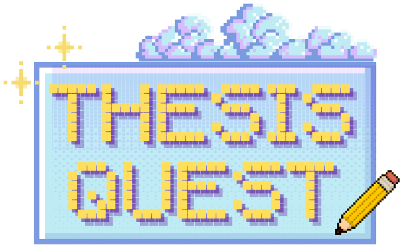

# **_CFG Degree Autumn 2024 - Group 1_** 
***
💫 **Members:**
+ Antigony Pollard
+ Emily Bunce
+ Emma Begum
+ Grace Parr
+ Gwen Michailidis
+ Ines Duarte
+ Johanna Manja Groening
***

💫 **Project Overview/Goals:**

Thesis Quest is a top-down college simulator game with an RPG and puzzle elements.
Set on a university campus, players guide the main character through various challenges to complete their PhD thesis before the deadline. 
The game highlights the balance of time, stress, and mental wellbeing, offering a fun yet relatable simulation of student life.
Our goal is to deliver entertaining and relatable experiences through diverse mini-games and challenges, offering broad appeal, replayability, and promoting a message of self-care.

***
💫 **How to Run Thesis Quest:**

1. Install required dependencies - pip install requirements.txt
2. Run Flask
3. Run game file from main/gameclass.py
4. Enjoy Thesis Quest!

***

💫 **Project Structure:**

+ **Assets** - Contains all game assets, including sprites, backgrounds, and music.  
+ **Handlers** - Manages player interactions using hitboxes.  
+ **Main** - Core game files and the game's entry point.  
+ **Tests** - Unit tests and testing functions.  
+ **Utilities** - Reusable code for features like the stress bar, speech, and timer.  
+ **World** - Handles world building, main map, and win/lose screen functionality.  
+ **.gitignore** - Specifies files and directories to exclude from version control.  
+ **README.md** - Project details and documentation (see below).  
+ **requirements.txt** - Lists Python dependencies required to run the game.

***

💫 **Key Features:**

+ **Start Menu** - Offers options to 'Start Game,' view 'Highscores,' or 'Quit' to exit the game.
+ **Time and Stress Meter** - Tracks the player’s progress and pressure levels. Players can reduce stress by completing challenges or visiting the student counseling office to play a relaxing mini-game. 
Mini-games can only be repeated if player doesn't win the game but at the cost of time.
+ **Five Mini-Games**:
   - **Library**: Test your knowledge in a quiz.
   - **IT Department**: Navigate through a maze.
   - **Classroom**: Sharpen your typing skills with a typing test.
   - **Counseling Building**: Relax by matching affirmations in pairs.
   - **Cafeteria**: Get ready for action in a text based food fight brawl.

***

💫 **Documentation:**

Read our [Documentation here](https://drive.google.com/file/d/1yYvpWRzkFy9Dtse66a0-ddEJznftf7VJ/view?usp=sharing)
